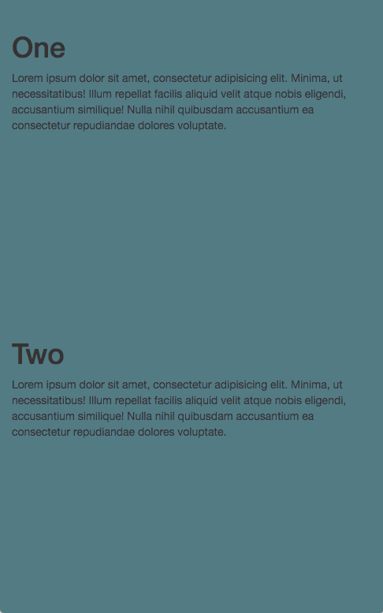

# Colour Scroller
-----------------
## What?

Transition between colors based on scoll position.
Heavily influenced by https://ustwo.com/.

## How?
Add to your project
```
npm install colour-scroller
```

Add html
```
<div class="row js-colour-stop" data-red="78" data-green="205" data-blue="196">
</div>

<div class="row js-colour-stop" data-red="78" data-green="205" data-blue="196">
</div>

<div class="row js-colour-stop" data-red="199" data-green="244" data-blue="100"
</div>
```

Add Javascript

```
import ColourScroller from 'color-scroller';
let colorStopDivs = document.getElementsByClassName('js-colour-stop');
new ColourScroller(colorStopDivs);
```



### Can I use a non npm version?

Yep, grab the copy from the lib folder and include however you see fit.
